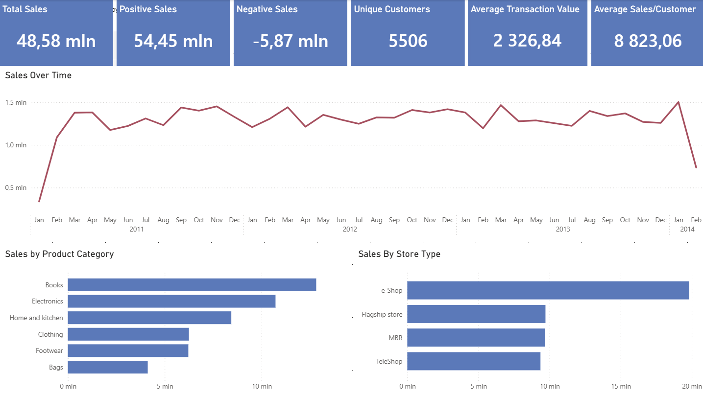
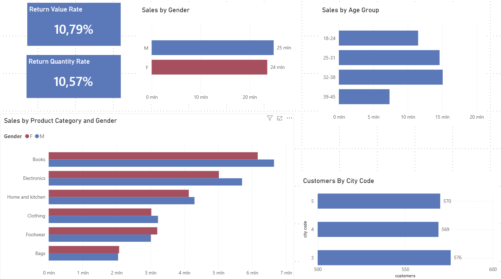

# Customer Sales Analysis – Power BI

## Project Overview

This project presents an analysis of customer sales data using Excel, Power Query and Power BI.

The main objective was to explore sales performance, customer characteristics, store types, product categories and returns, and to translate the analysis into an interactive Power BI dashboard.

## Business Questions

The analysis focuses on questions such as:

- How did total sales change over time?
- Which product categories generate the highest sales?
- Which store type generates the highest sales?
- Which product categories are most popular among female and male customers?
- Which city code has the largest number of customers?
- What is the share of customers from the largest city code?
- Which store type sells the most products in terms of value and quantity?
- What is the sales value of selected product categories in specific store types?
- What is the sales value of Electronics among male customers?
- How significant are returns?

## Tools & Technologies

- **Excel** – initial data preparation and analysis
- **Power Query** – data transformation and cleaning
- **Power BI** – data modelling, DAX measures and interactive visualisation

## Documentation

The detailed project documentation contains the data preparation process, calculated measures, exploratory analysis, business questions, supporting tables and analytical results used to build the Power BI dashboard.

[View the full project documentation](documentation/Customer_Sales_Analysis_Documentation.docx)

## Dashboard

The Power BI report consists of two pages:

### 1. Sales Analysis

The first page provides an overview of sales performance, including:

- Total Sales
- Positive Sales
- Negative Sales
- Unique Customers
- Average Sales per Customer
- Average Transaction Value
- Sales trend over time
- Sales by Product Category
- Sales by Store Type

### 2. Customer Analysis

The second page focuses on customer characteristics and returns, including:

- Sales by Age Group
- Sales by Gender
- Sales by Product Category and Gender
- Customers by City Code
- Return Value Rate
- Return Quantity Rate

## 🔎 Key Insights

- **E-shop** generated the highest sales, accounting for approximately **40.81% of total sales**.
- **Books** generated the highest sales among product categories.
- Customers aged **32–38** represented the strongest age group in terms of sales.
- **City Code 3** had the largest number of customers, with **576 customers (10.47% of total customers)**.
- In Flagship stores, **Electronics** generated higher sales than Clothing.
- Electronics sales among male customers amounted to approximately **5.70M**.
- Returns represented approximately **10.79% of sales value** and **10.57% of sold quantity**.

## Repository Structure

- `data/` – dataset and related files
- `powerbi/` – Power BI report
- `screenshots/` – dashboard screenshots
- `documentation/` – detailed project documentation and analysis
- `README.md` – project overview and key findings

## Dataset

The dataset used in this project is distributed under the **Apache License 2.0**.

The original dataset and its licensing terms should be consulted for information about the source and permitted use.

## Limitations

The dataset contains coded geographic information (`city_code`) rather than actual city names. Therefore, geographic analysis is limited to comparisons between city codes.

The analysis focuses on the information available in the dataset and does not include external demographic or geographic data.

##  Project Purpose

This project was created as a portfolio project to demonstrate practical skills in:

- data preparation,
- data transformation,
- DAX calculations,
- exploratory analysis,
- business-oriented data visualisation,
- and dashboard design.
